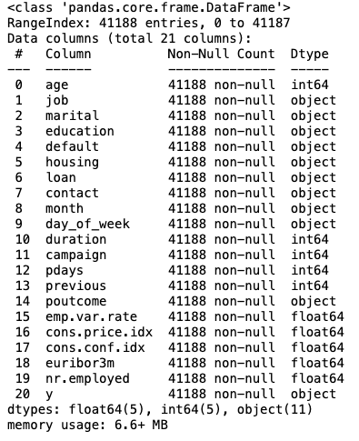
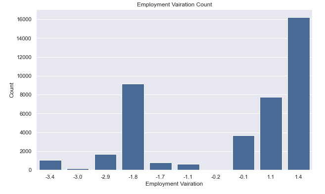
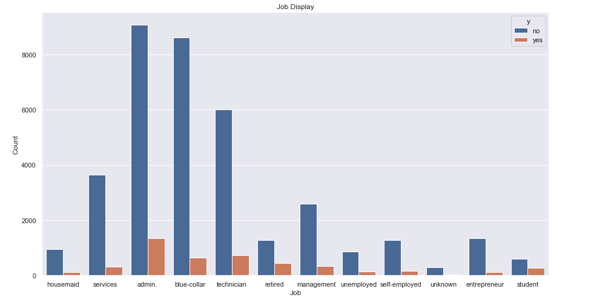
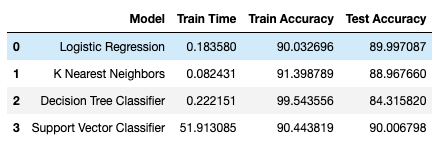

# Berkeley AI-ML Certification Course

## Practical Application #3

Files in this Folder:
- README.md
- Exploratory_Data_Analysis.ipynb
    - Problems 1-4 of the prompt
- ModelBuilding.ipynb
    - Problems 5-11 of the prompt
    
### Business Understanding
-----------------------------
Given the dataset, the goal is to analyze what features of the customer contribute to a successful directed marketing campaign to improve the success rate of the business. Directed marketing campaigns, by nature, are more specific and personalized to the consumer, so figuring out what features are conducive to a subscription is very helpful.

### Data Understanding
-------------------------

The features of the dataset are explained in the ModelBuilding.pynb file under Problem 3. A quick look at ```df.info()``` allows us to see the 19 features and the one target feature as well as their data types. There are no null values, although some values maybe marked unknown. 



#### Numeric Features
The numeric features specified in the dataset are: 'age', 'duration', 'campaign', 'pdays', 'previous', 'emp.var.rate', 'cons.price.idx', 'cons.conf.idx', 'euribor3m', 'nr.employed'

Of the 42 unique campaigns, only a few comprise majority of the dataset. Campaign 1 represented around 43% of the dataset, campaign 2 represented around 26%, cammpaign 3 represented around 13%, and the rest represented 7% or less. A pie chart to vizualize this distribution is shown below.


The three other numeric features that were specific to the campaign were duration, pdays, and previous. ALthough duration was not included in the modeling as it was too indicative a feature and would not be infromation that would help a business before it chooses to market to the client, I still displayed the distribution along with pdays and previous. Majority of clients in the dataset had never been contacted as indicated with the pdays value being 999 or the previous value being 0. Around 96% of clients had never been contacted and 86% of clients had 0 campaign attempts before the campaign. The distributions can be seen in Exploratory_Data_Analysis.ipynb.

The other numeric features were information regarding the socio economic context of the time in which the campaign took place. Employment variation rates were generally between 2% and -2%, indicating relatively stable employment during these camapigns, however, consumer confidence was generally low, around -35 to -50 during the campaigns.




#### Categorical Features
The categorical features from the dataset include: 'job', 'marital', 'education', 'default', 'housing', 'loan', 'contact', 'month', 'day_of_week', 'poutcome', 'y'

Of these categorical features, 5 were bank client specific and showed us some telling information regarding demographics that were more likely to commit to a long term subscription. Technicians, blue collar workers, and admin were the most targeted and therefore had the most subscriptions but retired people and students had the greatest proportion of successful subscriptions. Other than that, categorical features visually did not give us much information.




### Modeling 
--------------

I decided to use 4 different classification models:
1. Logistic Regression
2. K Nearest Neghbors
3. Decision Tree Classifiers
4. Support Vector Classifiers

I created a pipeline to scale the numerica features and one hot encode the categorical features. My target variable was 'y'. I created a train test split where the data was shuffled and 75% of the dataset was used for training the 25% was used for testing. I used the Dummy Classifier object first to crate a baseline prediction which had a accuracy score of 88.8%. 

I created the 4 models listed above in their standard form with no parameters and stored the training times, training accuracy, and test accuracy in a data frame. I then created a param grid for each model and used GridSearchCV to find which parameters gave me to best accuracy score.



### Results

All models outperformed the baseline model with Logistic Regression being the best in regards to accuracy as well as precision. KNN had the best recall. The code for my get_F1 function was incorrect so I only go duplicate values. For all the stats, view ModelBuilding.ipynb.
